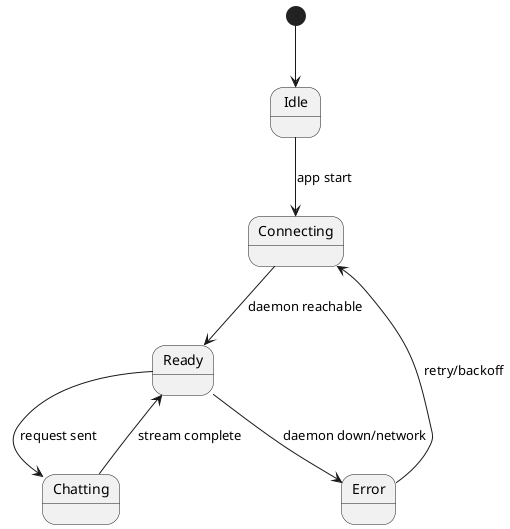

# React Frontend Plan – MLXR (Tray/Dock GUI)

A pragmatic plan for the WebView‑hosted React app that controls the MLXR daemon. Goals: fast, minimal, accessible, with real‑time token streaming and model management.

---

## Tech Choices

* **React + TypeScript** (Vite build) embedded via WebView in the macOS app bundle.
* **TailwindCSS** for utility styling; **shadcn/ui** components; **Framer Motion** for subtle transitions.
* **State**: lightweight **Zustand** store + **TanStack Query** for API data; **XState** only for complex flows (optional).
* **Charts**: **Recharts** for metrics.
* **Routing**: React Router.
* **I18n**: minimal (react‑i18next), en‑US default.

---

## App Shell & Navigation

* **Tray popover**: quick actions (start/stop daemon, switch model, tokens/s, latency, context used).
* **Dock window** (full GUI): tabs

  1. **Chat** (SSE streaming, tools)
  2. **Models** (registry; pull/import/convert; adapters)
  3. **Playgrounds** (Embeddings, Completion, Vision if enabled)
  4. **Metrics** (latency histograms, KV usage, GPU/CPU time)
  5. **Settings** (server.yaml editor, paths, privacy, updates)
  6. **Logs** (tail structured logs; search)

---

## Project Structure (Frontend)

```
app/ui/
  src/
    app.tsx               # Router + app shell
    main.tsx              # bootstrap
    lib/
      api.ts              # REST/SSE client (OpenAI/Ollama + native)
      bridge.ts           # WebView JS bridge to Swift/ObjC host
      store.ts            # Zustand store (session, models, settings)
      queryClient.ts      # TanStack Query instance
      sse.ts              # SSE helper with abort + backoff
      theme.ts            # theme + tokens
    components/
      Chat/
        ChatPane.tsx
        MessageList.tsx
        Composer.tsx
        TokenStream.tsx
        ToolCallView.tsx
      Models/
        RegistryTable.tsx
        ModelImport.tsx
        ModelCard.tsx
        QuantBadge.tsx
      Metrics/
        StatCards.tsx
        LatencyChart.tsx
        KVChart.tsx
      Settings/
        General.tsx
        Performance.tsx
        Paths.tsx
        Updates.tsx
      Logs/
        LogViewer.tsx
      Common/
        Button.tsx Input.tsx Dialog.tsx Tooltip.tsx
    pages/
      ChatPage.tsx
      ModelsPage.tsx
      PlaygroundsPage.tsx
      MetricsPage.tsx
      SettingsPage.tsx
      LogsPage.tsx
    types/
      api.ts              # shared DTOs
      model.ts
      metrics.ts
    styles/
      index.css
```

---

## IPC & Networking

**Transport**

* Primary: HTTP/REST over **Unix Domain Socket** proxied by host (Swift/ObjC) to the WebView via `fetch` polyfill or a custom bridge.
* SSE for token streams (OpenAI `/v1/chat/completions` SSE or native `/stream`).

**JS Bridge Contract (host ↔︎ UI)**

```ts
// ui/lib/bridge.ts
export interface HostBridge {
  request(path: string, init?: RequestInit): Promise<{ status: number; body: any }>
  openPathDialog(kind: 'models'|'cache'): Promise<string | null>
  readConfig(): Promise<string>
  writeConfig(yaml: string): Promise<void>
  startDaemon(): Promise<void>
  stopDaemon(): Promise<void>
  getVersion(): Promise<{ app: string; daemon: string }>
}

declare global { interface Window { __HOST__: HostBridge } }
```

**SSE Helper**

```ts
export async function streamTokens(url: string, body: any, onDelta: (t: string)=>void, signal: AbortSignal){
  const res = await fetch(url, { method: 'POST', body: JSON.stringify(body), headers: { 'Content-Type':'application/json' }, signal });
  const reader = res.body!.getReader();
  const dec = new TextDecoder();
  let buf = '';
  while(true){
    const { value, done } = await reader.read();
    if(done) break;
    buf += dec.decode(value, { stream: true });
    for(const line of buf.split('\n')){
      if(line.startsWith('data: ')){ onDelta(line.slice(6)); }
    }
    buf = buf.slice(buf.lastIndexOf('\n')+1);
  }
}
```

---

## Core Screens & UX Details

### Chat

* **Left**: conversations list (virtualized) with search.
* **Right**: messages (assistant, user, tool). Token streaming cursor effect.
* Controls: model selector, temperature/top‑p, max tokens, grammar/JSON schema toggle, *speculative decoding* toggle (default on), *KV persistence* toggle (default on).
* **Tool calls**: render function arguments/JSON; user approval flow.
* **Attachments**: image input when vision model loaded.

### Models

* Registry table with tags (family, quant, size, context), residency status, disk usage.
* Actions: **Pull**, **Import**, **Convert**, **Quantize** (wraps tools), **Set default**.
* Detail drawer: tokenizer info, rope scaling, adapter stack; quick test prompt.

### Playgrounds

* **Embeddings**: input box + vector preview; copy curl/JS/Python snippet.
* **Completion**: raw prompt testing; latency & tokens/s readout.

### Metrics

* Stat cards: current tokens/s, p50/p95 latency, KV usage %, draft acceptance rate.
* Charts: latency histogram, throughput over time, KV arena heatmap, GPU/CPU kernel time splits.

### Settings

* General: theme, language, launch at login, auto‑updates.
* Performance: target latency, max batch tokens, draft model, rope scaling preset.
* Paths: models dir, cache dir (with free‑space readout).
* Privacy: telemetry opt‑in, clear data.

### Logs

* Live tail with level filters; click to copy; export.

---

## State Model (High Level)



---

## Accessibility & Internationalization

* WCAG AA: focus rings, ARIA labels, keyboard shortcuts (⌘K command palette, ⌘I import model, ⌘/ toggle logs).
* High‑contrast theme; respects macOS dark mode.
* i18n scaffold with extraction script; en‑US shipped, others later.

---

## Performance Budget

* First interactive < 1.2s (cached), < 2.5s cold.
* Chat stream frame work ≤ 8ms/frame; message list virtualized.
* Route‑level code splitting; prefetch metrics after idle.

---

## Error Handling

* Global error boundary with toast notifications.
* Specific fallbacks: daemon not running → offer **Start**; UDS permission issue → guide to fix.
* SSE stream retry with exponential backoff.

---

## Telemetry (Opt‑in)

* UI perf metrics (TTI, FID), anonymized; no prompt/model names unless opted.
* Local log buffer viewable in Logs page.

---

## Testing Strategy

* Unit tests with Vitest + RTL.
* Contract tests against mock daemon (OpenAI & Ollama schemas).
* E2E (Playwright) scripts: startup, chat session, model pull, update flow.

---

## Deliverables

* `app/ui` repo with the above structure.
* Ready‑to‑embed `dist/` artifacts via Vite build.
* Type‑safe bridge API and SSE client.

---

## Open Questions

* Should the tray popover include a mini chat? (possible if daemon is reachable)
* Offline docs panel embedded or link to web?
