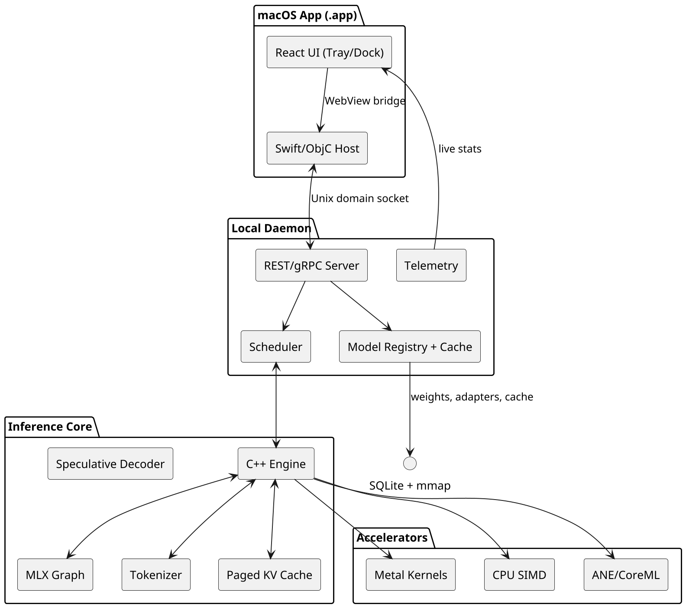
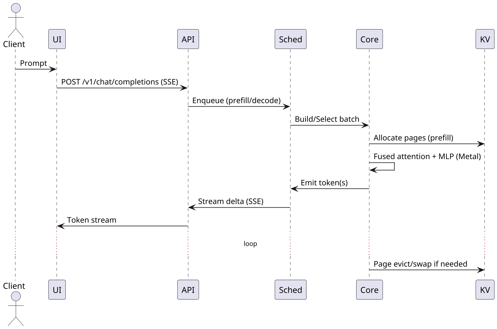

# MLXR – Project Overview & Architecture

## Project Overview

This document summarizes the repository layout and the runtime architecture of the macOS‑native LLM engine built on MLX + Objective‑C/C++ + Metal, with a React GUI (tray/dock) and OpenAI/Ollama‑compatible APIs.

---

## Folder Structure (Top Level)

```text
MLXR/
  app/                      # macOS app bundle & GUI
    macos/                  # Swift/ObjC host (tray/dock, Sparkle updater)
    ui/                     # React + Vite; built assets embedded in WebView
  daemon/                   # Background server (launch agent)
    server/                 # REST/gRPC, SSE streaming, auth, OpenAI/Ollama shims
    scheduler/              # Prefill/decode queues, batching, rate limiting
    registry/               # SQLite DB, model catalog, mmap loaders, tags
    telemetry/              # Metrics, tracing, profiling exporters
  core/                     # Inference engine (C++/ObjC++ + MLX)
    graph/                  # MLX module definitions (layers, attention, mlp)
    kernels/                # Performance‑critical ops
      metal/                # .metal shaders (fused attention, RoPE, RMSNorm, Q‑gemm)
      cpu/                  # Neon/SIMD fallbacks
    runtime/                # Engine orchestration, tokenizer, KV, sampler, spec
      tokenizer/            # SentencePiece/HF/tiktoken bridges
      kv/                   # Arena, pager, eviction, persistence
      spec/                 # Draft model proposer/verifier
  tools/                    # Converters and quantizers (HF↔GGUF↔MLX)
  sdks/                     # Client SDKs (python, ts, swift)
  configs/                  # Server & model configs (YAML)
  scripts/                  # Build/run helpers (metallib, app bundle, daemon)
  third_party/              # Vendored libs (if any)
  README.md                 # Quick start
  LICENSE                   # License
```

### Notable Files

* `daemon/server/openai_routes.cc` – `/v1/chat/completions`, `/v1/embeddings` (SSE)
* `daemon/server/ollama_routes.cc` – `/api/generate`, `/api/chat`, `/api/embed`, model mgmt
* `core/kernels/metal/attention_fused.metal` – QKV→RoPE→attn→softmax→ctx fused kernel
* `core/runtime/kv/arena.cc` – Paged KV arena; block allocator & page tables
* `configs/server.yaml` – batching, target latency, kv persistence, speculative settings

---

## Runtime Architecture (Component View)



**Key Principles**

* **Single‑machine, Apple Silicon first**: Maximize GPU via Metal; ANE opportunistic.
* **MLX arrays for model graphs** with escape hatches to custom kernels.
* **Continuous batching + paged KV** for throughput; **speculative decoding** for latency.
* **Unified memory aware**: mmap weights, minimal copies, pinned staging.

---

## Request Lifecycle (Sequence)



---

## Data & Configuration

* **SQLite schema**: models, adapters, tags, cache_entries.
* **Model configs** (`configs/models/*.yaml`): weight URIs (GGUF/HF/MLX), tokenizer, max context, quantization, rope scaling, chat template.
* **Server config** (`configs/server.yaml`): uds path/port, max_batch_tokens, target_latency_ms, enable_speculative, draft_model, kv_persistence.

---

## Build Targets

* **metallib**: compiled attention/rope/norm/Q‑gemm variants per head_dim & tile.
* **libmlxr_core.a**: C++ engine + MLX glue.
* **mlxrd**: daemon (REST/gRPC + scheduler + registry).
* **MLXR.app**: macOS bundle with WebView (React UI) + Host.
* **SDKs**: `pip install mlxrunner`, `npm i @mlx/runner`, SwiftPM package.

---

## Development Workflows

1. **Run daemon**: `./scripts/run_daemon.sh` → serves UDS + HTTP.
2. **GUI**: `yarn dev` in `app/ui` (hot reload) → Host points to dev server; `yarn build` to bundle.
3. **Models**: `tools/convert_hf_to_mlx.py` or `tools/convert_to_gguf.py`; add YAML to `configs/models/`.
4. **Kernels**: edit `.metal` → `scripts/build_metal.sh` → restart daemon.
5. **Perf**: enable profiler via `daemon/telemetry` flags; inspect p95 latency/KV arena utilization.

---

## API Surface (Compatibility)

* **OpenAI**: `/v1/chat/completions`, `/v1/completions`, `/v1/embeddings` (SSE streaming).
* **Ollama**: `/api/chat`, `/api/generate`, `/api/embed`, plus model mgmt endpoints.

---

## Notes

* Speculative decoding and KV persistence are **enabled by default** (tunable in `server.yaml`).
* The tray app can quick‑switch models and show live tokens/s, latency, and KV arena graphs.
